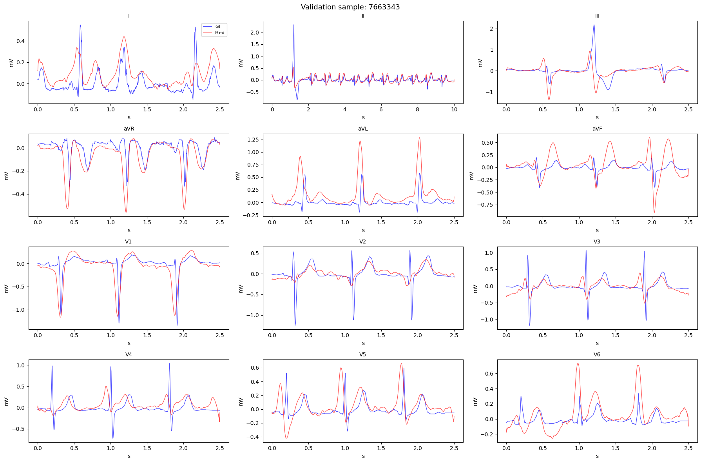

# ECG Image Digitization  
### PhysioNet 2025: Digitization of ECG Images  
Eva Tate

---

## Overview

Electrocardiograms (ECGs) are foundational to cardiovascular diagnosis. While modern ECG machines store signals digitally, decades of historical data remain preserved as paper printouts, scanned documents, or photographs. These image‑only records are not directly compatible with contemporary signal‑processing or machine learning systems.

The **PhysioNet 2025: Digitization of ECG Images** competition formalizes the problem of converting ECG images into calibrated, lead‑wise voltage time series suitable for downstream clinical AI models.

This repository contains an end‑to‑end pipeline that reconstructs 12‑lead ECG signals from scanned or photographed ECG images using deep learning, signal processing, and physiological constraints.

---

## Tech Stack

- PyTorch (CUDA + mixed precision training)
- segmentation_models_pytorch (ResNet‑34 U‑Net)
- NumPy / SciPy (signal processing, FFT, interpolation, filtering)
- Pandas (data handling)
- Matplotlib (validation visualization)

**Kaggle Notebook runtime (GPU ≤ 9h constraint)**

---

## Problem Formulation

Given an ECG image

$$
X \in \mathbb{R}^{H \times W \times 3}
$$

the task is to reconstruct 12 calibrated time‑series signals

$$
s^{(l)} \in \mathbb{R}^{T_l}, \quad l \in \{I, II, III, aVR, aVL, aVF, V1, \dots, V6\}
$$

where

$$
T_l = \lfloor f_s \cdot d_l \rfloor
$$

- $f_s$ = sampling frequency  
- $d_l$ = duration (10 s for Lead II, 2.5 s for others)

Performance is evaluated using a modified signal‑to‑noise ratio:

$$
\text{SNR}_{dB} =
10 \log_{10}
\left(
\frac{\sum_l \| s^{(l)}_{\text{gt}} \|^2}
{\sum_l \| s^{(l)}_{\text{gt}} - s^{(l)}_{\text{pred}} \|^2}
\right)
$$

after optimal horizontal and vertical alignment.

The objective is therefore precise reconstruction of morphology, amplitude scaling, and inter‑lead consistency, not merely segmentation accuracy.

---

## Method Overview

The pipeline consists of three stages:

1. Semantic segmentation of ECG traces
2. Signal extraction and physical calibration
3. Physiological constraint enforcement

A single forward pass per image produces a probability heatmap from which all 12 leads are reconstructed.

---

## Model Architecture

### U‑Net Backbone

A ResNet‑34 encoder U‑Net (via `segmentation_models_pytorch`) is used for trace segmentation.

- Input: grayscale ECG image (cropped, resized to 2048×1024)
- Output: single‑channel trace probability heatmap
- Loss: weighted binary cross‑entropy

$$
\mathcal{L} = \text{BCEWithLogitsLoss}(w_{\text{pos}} = 10)
$$

Trace pixels represent a small fraction of the image area; the weighted loss compensates for this imbalance.

---

## Fine‑Tuning Strategy

Pretrained weights from the Open ECG Digitizer model were loaded and fine‑tuned on clean `0001` images:

- 1500 samples  
- 2 epochs  
- AdamW optimizer  
- Learning rate $3 \times 10^{-4}$  
- Automatic mixed precision enabled  

Fine‑tuning adapts decoder weights to competition‑specific rendering characteristics while preserving encoder features.

---

## Signal Reconstruction

Segmentation produces a heatmap

$$
H \in [0,1]^{H \times W}
$$

The image is partitioned into 12 spatial bands corresponding to the canonical ECG layout.

---

### Sub‑Pixel Trace Estimation

For each column:

1. Gaussian smoothing ($\sigma = 0.5$)
2. Weighted centroid:

$$
y(x) =
\frac{\sum_y y \cdot H(y,x)}
{\sum_y H(y,x)}
$$

This yields a continuous sub‑pixel trace.

---

### Gap Handling

Low‑confidence columns are removed:

$$
\max_y H(y,x) < 0.08
$$

Missing values are linearly interpolated.

---

### Morphology‑Preserving Filtering

Savitzky–Golay filtering (window=9, polynomial=2) reduces jitter while preserving QRS morphology.

---

### Temporal Resampling

Fourier‑based resampling aligns signals to the required number of samples:

$$
T_l = \lfloor f_s \cdot d_l \rfloor
$$

---

## Physical Calibration

ECG paper is standardized:

- Large grid box = 5 mm = 0.5 mV

Pixels‑per‑mV is estimated via FFT of the row‑wise grayscale projection to detect grid periodicity.

Voltage conversion:

$$
s(t) = -\frac{y(t) - y_{\mathrm{baseline}}}{\mathrm{px\ per\ mV}}
$$

Baseline is estimated from low‑variance sliding windows approximating TP segments.

An interquartile range normalization constrains amplitudes to physiologically realistic ranges.

---

## Physiological Constraint Enforcement

Einthoven’s law:

$$
\text{Lead II} = \text{Lead I} + \text{Lead III}
$$

Residual error over overlapping windows is distributed:

```python
residual = II[:n] - (I[:n] + III[:n])
I      += residual / 3
III    += residual / 3
II[:n] -= 2 * residual / 3
```

This enforces inter‑lead consistency and improves reconstruction stability.

---

## Results: Validation Example

Below is a representative validation reconstruction.  
Blue: ground truth  
Red: reconstructed signal



The model preserves QRS morphology, amplitude polarity, and temporal alignment across all 12 leads.

---

## Inference Pipeline

For each test image:

1. Grayscale conversion  
2. Header cropping  
3. Resize to 2048×1024  
4. Single forward pass (PyTorch, GPU)  
5. Heatmap → signal conversion  
6. Calibration + Einthoven correction  
7. Write `submission.parquet`

All 12 leads are reconstructed from a single segmentation pass.

---

## Citation

This work builds upon the Open ECG Digitizer model.  

```bibtex
@article{stenhede_digitizing_2026,
  title        = {Digitizing Paper {ECGs} at Scale: An Open-Source Algorithm for Clinical Research},
  author       = {Stenhede, Elias and Bjørnstad, Agnar Martin and Ranjbar, Arian},
  journal      = {npj Digital Medicine},
  year         = {2026},
  doi          = {10.1038/s41746-025-02327-1},
  url          = {https://doi.org/10.1038/s41746-025-02327-1},
  shorttitle   = {Digitizing Paper {ECGs} at Scale}
}
```

---

## Competition Reference

PhysioNet – Digitization of ECG Images (2025)  
https://kaggle.com/competitions/physionet-ecg-image-digitization